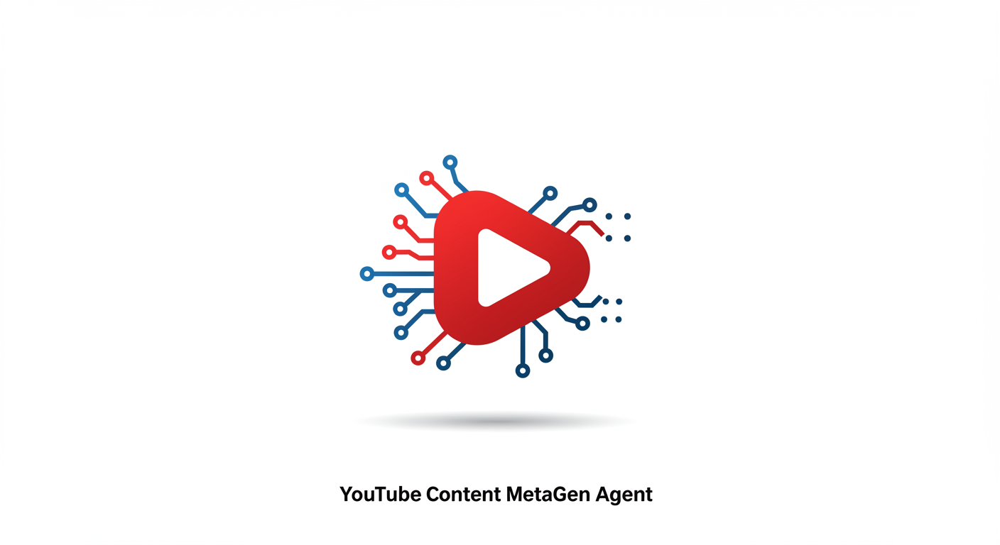
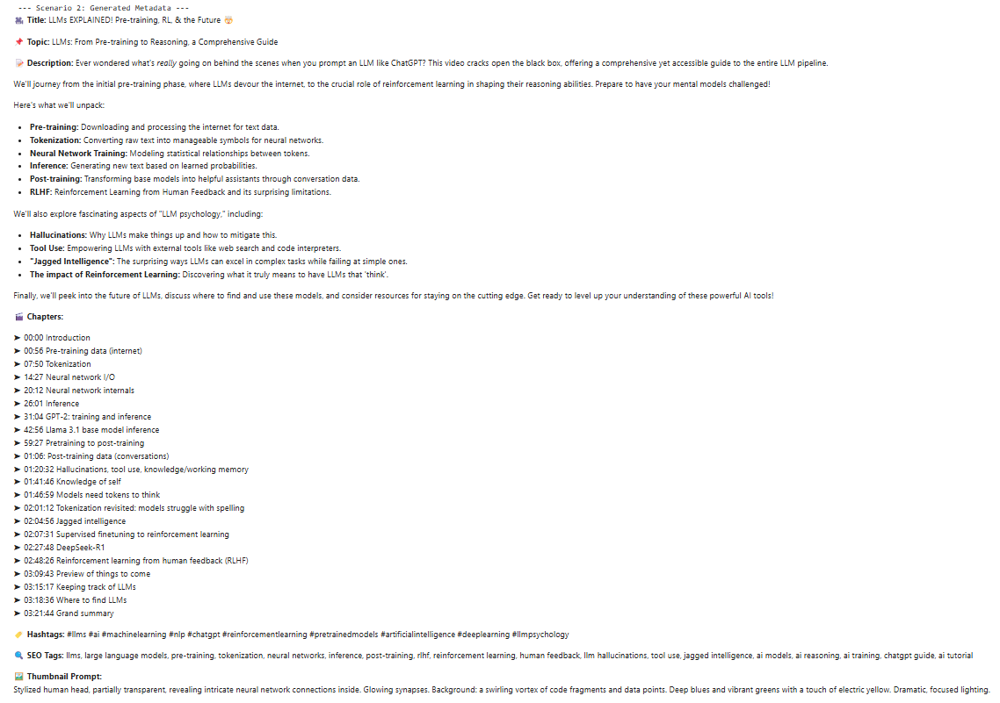

# Automating the Grind: Generating YouTube Metadata with the Gemini API (My Kaggle Capstone Project)

---


[](https://www.kaggle.com/code/dzianisbialou/youtube-content-metagen-agent) [](https://youtu.be/NqeRV9jw3ng)

## 📖 Table of Contents

1. [Introduction](#introduction)
2. [Problem](#problem)
3. [Solution](#solution)
4. [How It Works](#how-it-works)
5. [Demonstration](#demonstration)
6. [Limitations and Future Plans](#limitations-and-future-plans)
7. [How to Run the Project](#how-to-run-the-project)
8. [How to Contribute](#how-to-contribute)
9. [License](#license)

---

## Introduction

Hello, fellow Homo Dataens! Dzianis here.

Today, I want to share my Capstone project for **Kaggle's Gen AI Intensive course (Q1 2025)**. As a YouTube content creator myself, I faced a recurring, yet crucial, challenge: preparing video metadata.

## 🚨 Problem

Creating titles, descriptions, tags, chapters, and thumbnail ideas for hundreds of videos manually consumes countless hours — time that could be better spent on creativity.  
Honestly? I got lazy! 😅

## ✅ Solution

So, I decided to automate this process using **generative AI**, specifically **Google's Gemini API**. I developed the **YouTube Content MetaGen Agent**, a tool designed to handle this routine task.

---

## 🎯 The Creator's Problem: Routine Kills Creativity

Over the past year, I've prepared metadata for over 300 videos and livestreams, featuring various guests and covering diverse topics. Each one requires:

- A catchy **title**
- An informative **description**
- Relevant **tags and hashtags**
- Often, timestamped **chapters** for longer content

This adds up to hours of work every week.

💡 **Goal:** Free up creators' time and allow us to focus on producing great content by letting AI handle metadata generation.

---

## 🤖 How It Works

My project is implemented as a **Kaggle Notebook**, featuring an AI agent that generates a complete metadata set.  
It works in two main scenarios:

### 🛠️ Scenario 1 — Planning Ahead

You provide:

- A topic idea
- Key points (theses) for an upcoming video or livestream

The agent generates:

- ✅ Title
- ✅ Description
- ✅ Tags and hashtags
- ✅ Prompt for thumbnail generation

### 📼 Scenario 2 — Post-Production Metadata

You provide:

- A **full video transcript**

The agent analyzes it to create:

- ✅ Topic & Title
- ✅ Description
- ✅ Tags and hashtags
- ✅ Prompt for thumbnail
- ✅ **Chapters with timestamps**

> ✅ Built with Python and the `google-genai` library (official Gemini SDK).

---

## 🧠 How It Works: Leveraging GenAI Capabilities (with Code Snippets)

The notebook uses a **modular design**, leveraging several key features of Gemini API:

### 1. 🪄 Prompt Engineering & Few-Shot Learning

Well-designed prompts are essential. Each subtask uses a specific template that defines:

- AI's role
- Output structure
- Optional few-shot examples

📦 **Example Prompt: Topic & Title from Transcript**

```python
TOPIC_TITLE_PROMPT_FROM_TRANSCRIPT = """
You are a YouTube metadata assistant. Analyze the **full transcript** of a video to understand its core theme.

Generate exactly TWO lines:
1. A concise **topic** summarizing the video's core subject.
   - Max 100 characters.
   - A short sentence or phrase.
2. A **catchy YouTube-style title** (under 70 characters preferred).
   - Designed to attract viewers interested in the topic.

📌 Format (strict):
<topic>
<title>

❌ Do NOT include any labels, numbers, colons, or explanations.

✅ Example:
Understanding Large Language Models in Plain English
LLMs Explained: How ChatGPT Really Works

---
Full Transcript:
{transcript_text}
---

Generate the output now:
"""
```

### 2. 📦 Structured Output as JSON

To ensure clarity and consistency, we ask the model to return tags/hashtags in JSON format.

📦 **Prompt Snippet (Cell 3.3.A):**

```python
# ... (task instruction) ...
- Provide the output **ONLY** as a valid JSON object:
```json
{
  "hashtags": ["#aiforcreators", "#youtubetips"],
  "tags": ["ai youtube automation", "youtube seo"]
}
```
```
📦 **Processing in Python (Cell 3.3.B):**

```python
# Clean markdown fences
if text.startswith("```json"):
    text = text.lstrip("```json").rstrip("```")

try:
    tags_json = json.loads(text)
    hashtags = tags_json.get("hashtags", [])
    tags = tags_json.get("tags", [])
except json.JSONDecodeError:
    print("❌ Error: Could not parse model output as JSON.")
```
### 3. 🌐 Grounded Generation via Google Search Tool
To generate timely and relevant descriptions, the agent uses real-time Google Search grounding.

📦 **Search Activation Snippet (Cell 3.2.B):**
```python
from google.genai import types

config_with_search = types.GenerateContentConfig(
     tools=[types.Tool(GoogleSearch=types.GoogleSearch())]
)

search_response = client.models.generate_content(
     model=MODEL_NAME,
     contents=[search_query],
     config=config_with_search
)

search_text = search_response.candidates[0].content.parts[0].text.strip()
```
### 4. 📜 Long Context & Document Understanding
Scenario 2 relies on Gemini's ability to handle very long transcripts (e.g., >200k characters) and return meaningful outputs like chapters with timestamps.

📦 **Chapter Generation Snippet (Cell 3.4.B):**
```python
prompt = CHAPTERS_PROMPT.format(transcript=transcript_text)

response = client.models.generate_content(
     model=MODEL_NAME,
     contents=prompt
)

chapters_output = response.text.strip()
```
## 🎬 Demonstration


*Example: Agent-generated metadata with structured chapters.*

## ⚠️ Limitations and 🔮 Future Plans
**Limitations:**

- Output quality depends on input quality (especially transcripts)
- Some outputs might require manual refinement
- API usage subject to quotas (especially grounding on free tier)
- Availability of specific Gemini models may vary

**Planned Improvements:**

- Integration with Google Sheets + YouTube API
- Speaker recognition & database
- Output quality checks + API cost tracking
- Further prompt optimization
- Minimal web UI for batch processing
- Integration with messenger (Telegram)

---

## 🚀 How to Run the Project

1. Open the [Kaggle Notebook](https://www.kaggle.com/code/dzianisbialou/youtube-content-metagen-agent).
2. Click the "Copy and Edit" button to create your own version of the notebook.
3. Run all cells in the notebook sequentially.
4. Follow the instructions provided in the notebook to generate metadata.

---

## 🤝 How to Contribute

We welcome community contributions! To make changes:

1. Fork the repository.
2. Create a new branch for your changes:
   ```bash
   git checkout -b feature/your-feature
   ```
3. Make your changes and commit them:
   ```bash
   git commit -m "Added a new feature"
   ```
4. Push your changes to your fork and create a Pull Request.

---

## 📜 License

This project is licensed under the MIT License. See the LICENSE file for details.

---

**🔗 Links:**
- 📓 Kaggle Notebook: https://www.kaggle.com/code/dzianisbialou/youtube-content-metagen-agent
- ▶️ YouTube Demo Video: https://www.youtube.com/watch?v=NqeRV9jw3ng

💬 Feedback Welcome!
I’d love to hear your feedback — comment on the Kaggle notebook or YouTube video with suggestions or questions!

👋 May the Metadata be with you! 🤖📊
